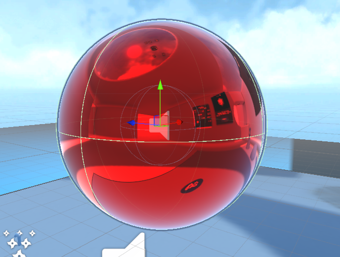
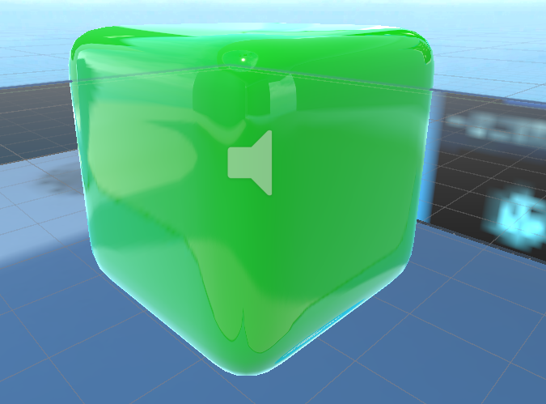
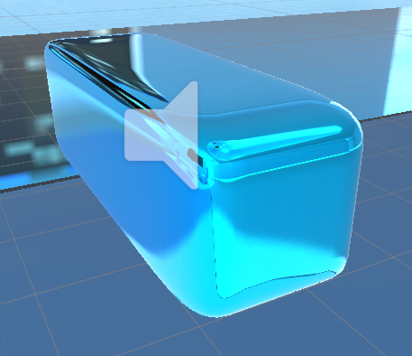
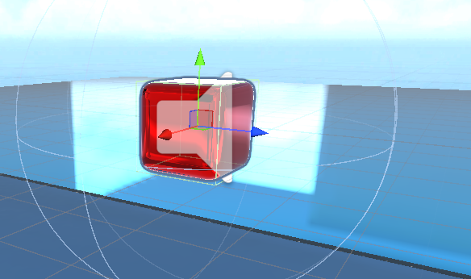
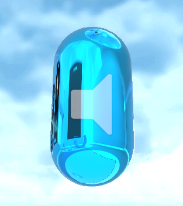

# GameObject-Components
GameObject&amp;Components

## GameObject 1

The first gameobject is a sphere with a red matalic materal.

This object is a grabbable game object

## GameObject 2

This gameobject is a cube with a green non matalic materal.

This object is a grabbable game object

## GameObject 3

This gameobject is a cube with a blue matalic materal.

This object is a grabbable game object

## GameObject 4

This gameobject is a cube with a red matalic materal.

This object is a grabbable game object

## GameObject 5

This gameobject is a capsule with a blue matalic materal.

This object is a grabbable game object
